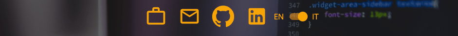

# React Portfolio

A responsive website to showcase some of my work.

### screenshot


### Built with

- HTML/CSS
- Javascript
- [React](https://reactjs.org/) - JS library.
- [MaterialUI](https://mui.com/) - React Library.
- [React Animate on Scroll](https://www.npmjs.com/package/react-animate-on-scroll) - A React animation library.
- [React-Tilt](https://www.npmjs.com/package/react-tilt) - A plug in which gives a tilting effect to react components when hovered over.

### What I learned

My second project using the MaterialUI framework. During this project I feel like my knowledge of this framework has improved A lot. I learned how to utilise the theme feature of MaterialUI to share global css variables throughout the project which allows for quicker styling and also makes future changes much easier.

I believe this project has given me a solid grasp of the MaterialUI framework and it is definitely a tool I would consider using in the future to speed up the development of future projects.

### Features

To make the page more visually pleasing I decided to use an animation library called Animate on Scroll which, as the name suggests, fires animations as the user scrolls down the page. I believe this makes the user experience a much more engaging one rather than just static information on the page. I also used another plugin called Tilt which adds a nice animation to the project tile images when the user hovers over them.

For this project I decided to store the data which is displayed on the page in a separate data file which can be easily updated if I need to add new projects or remove old ones.

As I will be applying for Web Development positions in Italy I decided to add the functionality to switch languages between Italian and English using a toggle button in the nav bar as shown below.



this was achieved by having two lots of data stored in the data file under each key as shown below

```javascript
{
    id: nanoid(),
    img: room,
    title: [
      'Landing Page For Furniture Website',
      'Pagina di destinazione per il sito web di mobili',
    ],
    info: [
      'Landing Page For Furniture Website built with React, and styled components and  React Hooks',
      'Pagina per il sito Web di mobili costruito con React, Styled Components e React Hooks',
    ],
    info2: 'React, React Hooks and Styled Components',
    url: 'https://wekiban.github.io/Room/',
    repo: 'https://github.com/WeKiBan/Room',
  }
```

and then making use of the useState hook to keep track of which language is currently active and selecting either the first or second item in each array depending on the setting. An example of how this works can be seen below:

```javascript
aboutData.info[+english].map((paragraph, index) => (
  <Typography key={index} className={classes.info}>
    {paragraph}
  </Typography>
));
```

Applying the + converts the boolean to a number so if english is true the second option is returned otherwise the first option will be returned.

This is the first time I have approached a project this way and I believe it will come in very useful in future projects to keep all the website data in the same place and make it more manageable.

## Get started

### Clone this repository

From your command line, first clone this repo: https://github.com/WeKiBan/new-portfolio

`$ git clone https://github.com/WeKiBan/new-portfolio`

### Go into the repository

`$ cd new-portfolio`

### Remove current origin repository

`$ git remote remove origin`

### Install dependencies

`$ npm install`

### Start development server

`$ npm start`

You should now have a development server running in your default browser.

```

```
